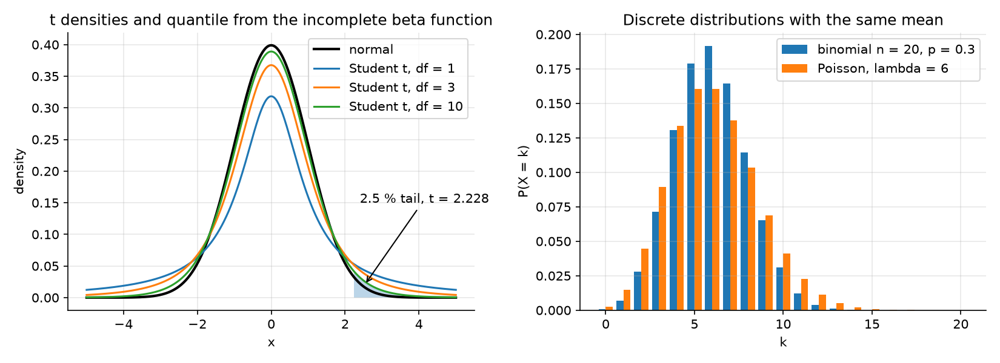
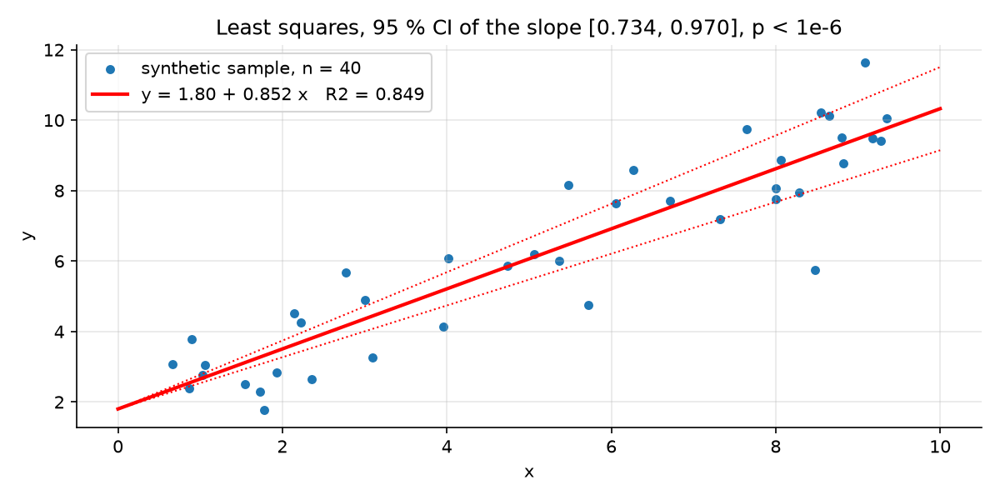

# statlab: Statistics from First Principles


Descriptive statistics, probability distributions, confidence intervals, hypothesis tests and regression inference, written in pure Python with no numerical dependencies. The special functions behind the Student, chi-square and Fisher distributions (regularised incomplete gamma and beta) are implemented from their series and continued-fraction expansions.

Every result is validated against SciPy in the test suite, so the library can be trusted for coursework while still showing how each statistic is computed.

## Contents

| Module | Functions |
| --- | --- |
| `descriptive` | mean, median, mode, variance and standard deviation (sample or population), quantiles (NumPy/R method 7), IQR, skewness, excess kurtosis, covariance, Pearson correlation, frequency tables, `describe` |
| `distributions` | Normal, Student t, chi-square and F: pdf, cdf, ppf. Binomial and Poisson: pmf, cdf. Exponential cdf |
| `inference` | z test; one-sample, two-sample (Student and Welch) and paired t tests with one- or two-sided alternatives; mean CI; proportion CI (Wilson or Wald); chi-square goodness of fit and independence; one-way ANOVA |
| `regression` | Simple linear regression with slope and intercept standard errors, t test, confidence interval and R squared |
| `special` | Regularised incomplete gamma and beta functions, CDF inversion |

## Installation

Install the latest version directly from GitHub:

```bash
pip install "git+https://github.com/GUELORD-MWENDERWA/statistics-from-scratch.git"
```

Or download the wheel from the [latest release](https://github.com/GUELORD-MWENDERWA/statistics-from-scratch/releases/latest) and run `pip install statlab-0.1.0-py3-none-any.whl`.

For development:

```bash
git clone https://github.com/GUELORD-MWENDERWA/statistics-from-scratch.git
cd statistics-from-scratch
pip install -e ".[dev]"    # dev extras bring SciPy and NumPy for the tests only
```

## Example

Do students taught with method A score higher than those taught with method B?

```python
import statlab as sl

a = [72, 75, 68, 80, 77, 74, 79, 71, 76, 78]
b = [70, 68, 65, 72, 69, 71, 67, 66, 73, 70]

r = sl.t_test_two_sample(a, b)          # Welch test, unequal variances
r.name, r.statistic, r.df, r.p_value    # ('Welch t test', 4.051, 15.91, 9.36e-04)
r.reject(alpha=0.05)                    # True

sl.mean_ci(a)                           # (72.281, 77.719), 95 % interval for method A

fit = sl.linear_regression([1, 2, 3, 4, 5, 6], [2.1, 3.9, 6.2, 7.8, 10.1, 12.2])
fit["slope"], fit["r2"]                 # (2.02, 0.9982)
```

## Results

The figures below are produced by the library itself. Regenerate them with `pip install matplotlib && python docs/make_figures.py`.



*Student t densities and discrete distributions computed by statlab*



*Least-squares fit with the confidence interval of the slope*

## How the distributions are computed

- **Normal cdf** from the complementary error function: `Phi(x) = erfc(-x / sqrt 2) / 2`.
- **Student t cdf** through the incomplete beta function: the tail probability is `I_{df/(df+x^2)}(df/2, 1/2) / 2`.
- **Chi-square cdf** is the regularised lower incomplete gamma `P(df/2, x/2)`.
- **F cdf** is `I_{d1 x/(d1 x + d2)}(d1/2, d2/2)`.
- **Quantiles** (ppf) invert the cdf by bisection to 1e-12 relative tolerance.

## Validation

```bash
pytest
```

The tests compare against `numpy` and `scipy.stats` for descriptive statistics, every cdf at several degrees of freedom, quantiles from the 1st to the 99.9th percentile, all t tests, chi-square tests, ANOVA, confidence intervals and regression standard errors. SciPy is a test dependency only.

## Roadmap

- Non-parametric tests (Mann-Whitney U, Wilcoxon signed-rank, Kruskal-Wallis)
- Multiple regression with matrix formulation and diagnostics
- Bootstrap confidence intervals

## License

MIT. See [LICENSE](LICENSE).
